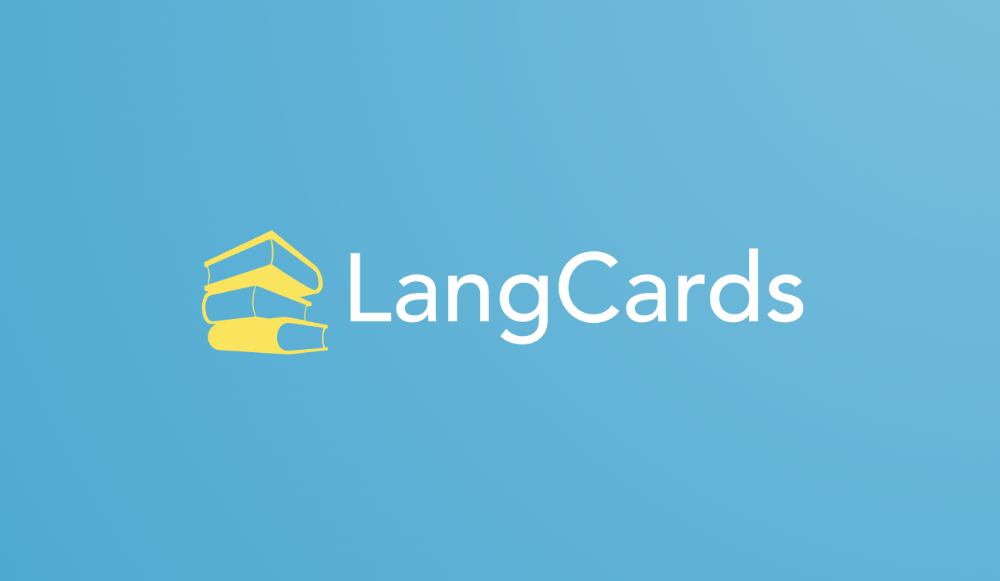
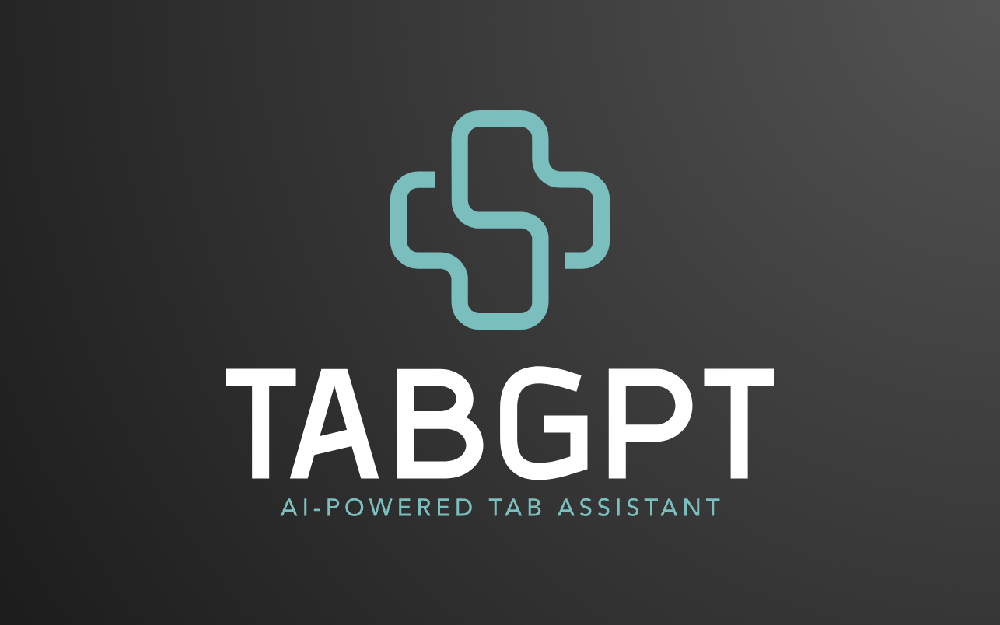

# Dionis Gonzalez - Full-Stack Software Engineer

## Welcome to my GitHub Profile! 👋

Software engineer with experience in full-stack and data engineering. Passionate about developing creative business solutions that solidify the digital footprint and operations of organizations. Background in sales, customer service, and education, providing effective communication strategies when discussing goals and expectations, and a team-oriented structure when working with groups. Based in Denver, CO.

My career goal is to learn more about the fields of Artificial Intelligence and Human-Computer Interaction, focusing on industries such as e-commerce, education, and finance.

I also write about technologies and life when I find a chance. Step into the matrix of tech with me, and decode life jargon together!

---

## 📚 Table of Contents

1. [About Me](#about-me)
2. [Technical Skills](#technical-skills)
3. [Featured Projects](#featured-projects)
4. [Experience and Education](#experience-and-education)
5. [Certifications and Achievements](#certifications-and-achievements)
6. [Contact Information](#contact-information)

---

## 🤵 About Me

- 💡 I like to explore new technologies and develop interesting software solutions.
- 🎓 Currently pursuing a Master's in Computer Science from Georgia Institute of Technology.
- 🎓 Have a Bachelor's in Network Technology and Application Development from NUC University.
- 🎓 Finished a Full-Stack Software Engineering Certificate - Thinkful.
- ✍️ In my free time, I enjoy watching anime/movies, playing some piano, and catching up on interesting trends and topics.
- 💬 Feel free to reach out to me for any project or volunteering, even just some conversation.

---

## 💻 Technical Skills
### **Frontend**
HTML&nbsp;&nbsp;|&nbsp;&nbsp;CSS&nbsp;&nbsp;|&nbsp;&nbsp;JavaScript&nbsp;&nbsp;|&nbsp;&nbsp;jQuery&nbsp;&nbsp;|&nbsp;&nbsp;React&nbsp;&nbsp;|&nbsp;&nbsp;Redux&nbsp;&nbsp;|&nbsp;&nbsp;Vue.js&nbsp;&nbsp;|&nbsp;&nbsp;Vuetify

### **Backend**
Python&nbsp;&nbsp;|&nbsp;&nbsp;Node.js&nbsp;&nbsp;|&nbsp;&nbsp;Express.js&nbsp;&nbsp;|&nbsp;&nbsp;TypeScript&nbsp;&nbsp;|&nbsp;&nbsp;Knex.js&nbsp;&nbsp;|&nbsp;&nbsp;OAuth&nbsp;&nbsp;|&nbsp;&nbsp;JWT&nbsp;&nbsp;|&nbsp;&nbsp;Firebase

### **Databases**
SQL/PostgreSQL&nbsp;&nbsp;|&nbsp;&nbsp;BigQuery

### **Data Engineering & ETL**
Airflow&nbsp;&nbsp;|&nbsp;&nbsp;DBT

### **Testing**
Jest&nbsp;&nbsp;|&nbsp;&nbsp;Cypress&nbsp;&nbsp;|&nbsp;&nbsp;WebDriverIO&nbsp;&nbsp;|&nbsp;&nbsp;Mocha&nbsp;&nbsp;|&nbsp;&nbsp;Chai&nbsp;&nbsp;|&nbsp;&nbsp;Supertest&nbsp;&nbsp;|&nbsp;&nbsp;Enzyme&nbsp;&nbsp;|&nbsp;&nbsp;Cucumber&nbsp;&nbsp;|&nbsp;&nbsp;
### **CI/CD & Cloud**
- CircleCI
- Google Cloud Platform

---

## 🌟 Featured Projects

### [FlickShare](https://dionis-gonzalez-portfolio.netlify.app/pong.html)

&nbsp;&nbsp;&nbsp;&nbsp;Personalized movie suggestions based on full custom lists, not just one movie!

**Technologies used:**
- React
- CSS
- JavaScript
- Node.js
- Express
- Knex
- PostgreSQL
- Mocha
- Chai
- JWT
- Vercel
- Heroku

---

### [LangCards](https://dionis-gonzalez-portfolio.netlify.app/pong.html)

&nbsp;&nbsp;&nbsp;&nbsp;A Spanish language trainer app that uses spaced repetition for effective learning.

**Technologies used:**
- React
- CSS
- JavaScript
- Node.js
- Express
- Knex
- PostgreSQL
- Mocha
- Chai
- Cypress
- JWT
- Helmet
- Vercel
- Heroku

---

### [TabGPT](https://dionis-gonzalez-portfolio.netlify.app/pong.html)

&nbsp;&nbsp;&nbsp;&nbsp;An AI-powered Chrome extension that answers questions from the text in active tabs.

**Technologies used:**
- HTML
- CSS
- JavaScript
- Chrome API
- GPT

---

## 🚧 Work Experience
**MikMak** 

&nbsp;&nbsp;&nbsp;&nbsp;*Software Engineer*  - Jul 2022 - Jan 2023

&nbsp;&nbsp;&nbsp;&nbsp;*Associate Software Engineer* - Apr 2021 - Jul 2022

**Hilton Hotels & Resorts**  
&nbsp;&nbsp;&nbsp;&nbsp;*Steward Supervisor* - Feb 2020 - Oct 2020

**Zovio**  
&nbsp;&nbsp;&nbsp;&nbsp;*Military Enrollment Advisor* - Apr 2020 - Sep 2020

**NUC University - Online Division**  
&nbsp;&nbsp;&nbsp;&nbsp;*Admissions Officer* - Nov 2016 - Nov 2019

---

## 🎓 Education

- Master's in Computer Science, Georgia Institute of Technology (in progress)
- Bachelor's in Network Technology and Application Development - NUC University
- Full-Stack Software Engineering Certificate - Thinkful

## 🏆 Certifications and Achievements

- Group 2 Social / Behavioral Research Investigators and Key Personnel - CITI Program
 -Fundamentals of Digital Marketing - Google
- Google My Business Basics Certification - Google
- Digital Sales Certification - Google

## 📞 Contact Information

&nbsp;&nbsp;&nbsp;&nbsp;✉️ You can shoot me an email at [dionisggr@gmail.com](mailto:dionisggr@gmail.com)! I'll try to respond as soon as I can.
- [LinkedIn](https://www.linkedin.com/in/dionis-gonzalez/)
- [Personal Website](https://www.dioveloper.com/)
- [My Resume](https://drive.google.com/file/d/1R5c_-jpCvC3_e1QuuR5Ph1NXcsrhzc77/view?usp=sharing)

---

🔝 [Back to Top](#table-of-contents)
